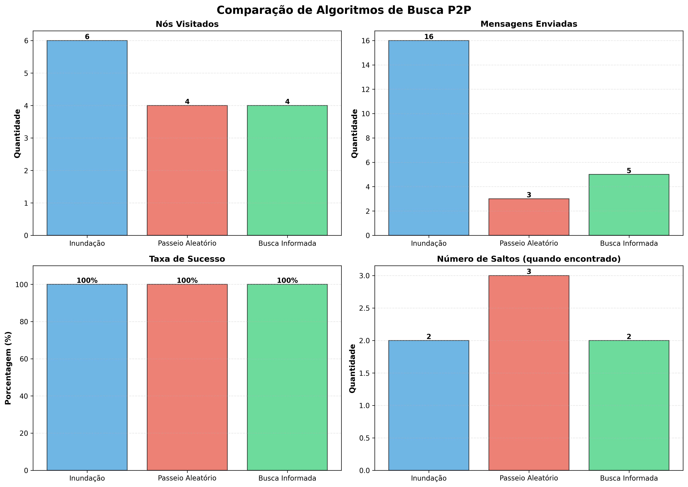
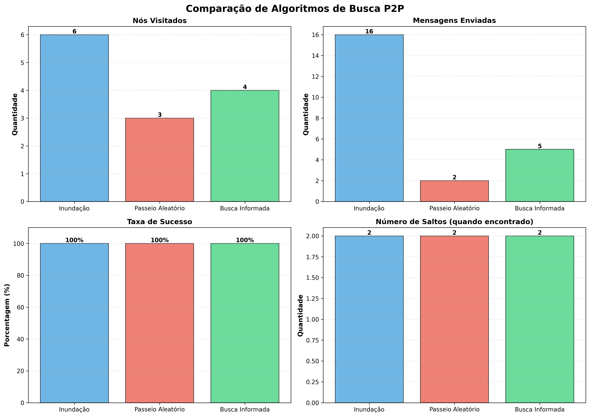
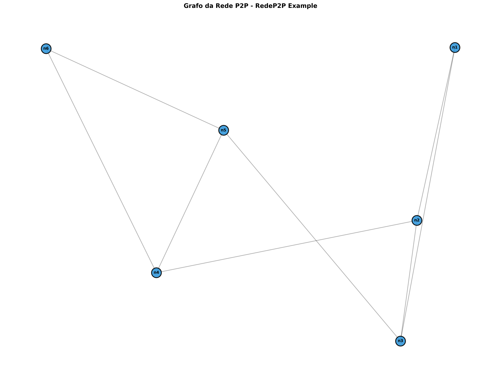
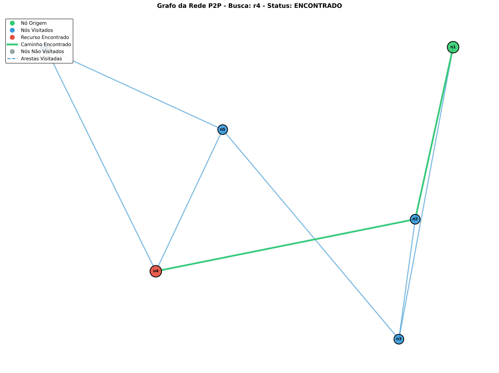
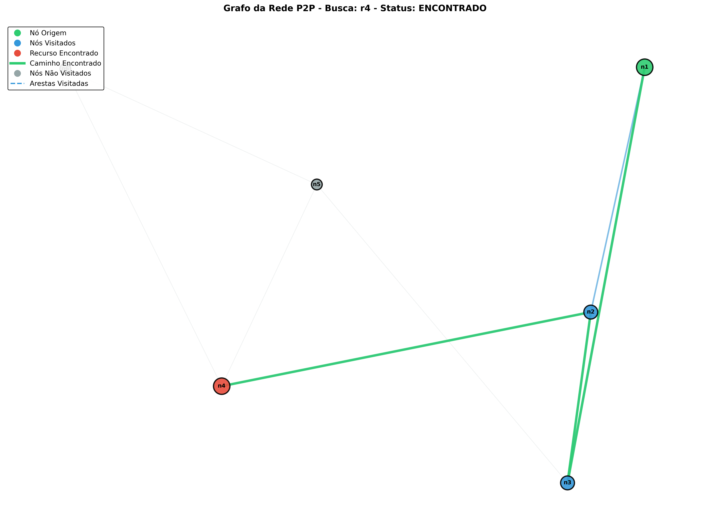
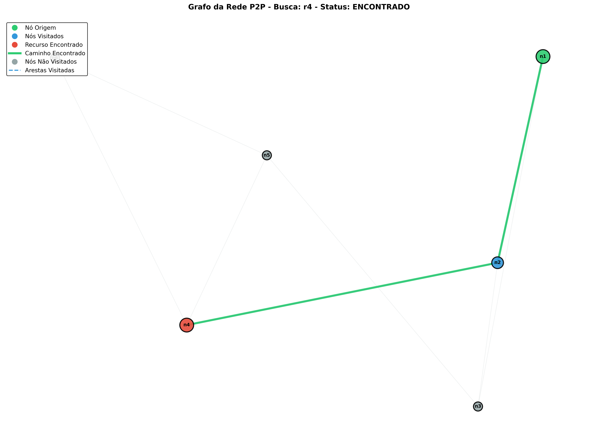
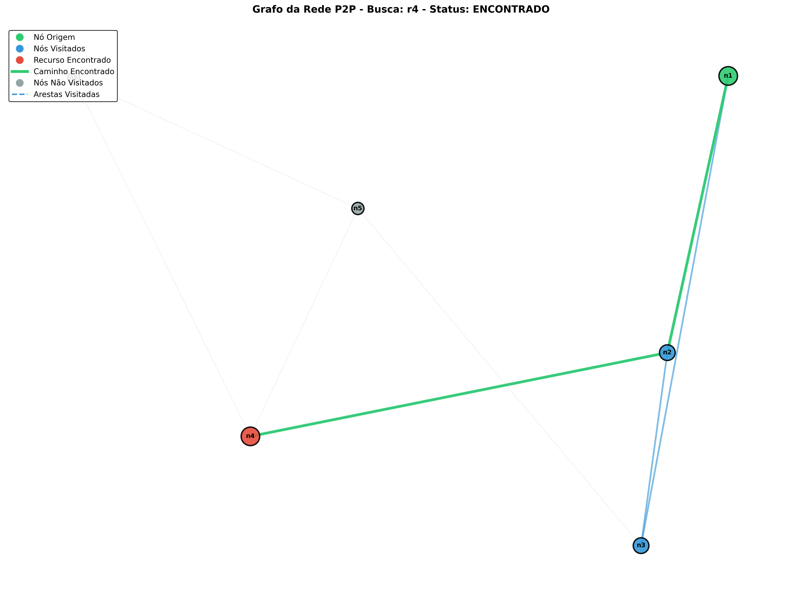

# Simulador de Rede P2P - Algoritmos de Busca

Este projeto implementa um simulador de rede P2P (Peer-to-Peer) não estruturada com três diferentes algoritmos de busca por recursos.

## 📋 Descrição

O simulador permite criar uma rede P2P a partir de um arquivo de configuração JSON e realizar buscas por recursos utilizando diferentes estratégias:

1. **Busca por Inundação (Flooding)** - Propaga a consulta para todos os vizinhos
2. **Busca por Passeio Aleatório (Random Walk)** - Escolhe aleatoriamente o próximo nó
3. **Busca Informada (Informed Search)** - Utiliza heurísticas baseadas em histórico de sucesso

## 🏗️ Estrutura do Projeto

```
RedeP2P/
├── main.py                 # Programa principal com interface CLI
├── node.py                 # Classe Node - representa um nó da rede
├── p2p_network.py          # Classe P2PNetwork - gerencia a rede
├── search_algorithms.py    # Implementação dos algoritmos de busca
├── config.json             # Arquivo de configuração de exemplo
└── README.md               # Este arquivo
```

## 📦 Requisitos

- Python 3.6 ou superior
- Bibliotecas necessárias (instalar via `pip install -r requirements.txt`):
  - matplotlib (para gráficos de barras)
  - networkx (para visualização de grafos)

## 🚀 Como Usar

### 1. Instalar dependências

```bash
pip install -r requirements.txt
```

### 2. Executar o programa

```bash
python main.py
```

Ou especifique um arquivo de configuração:

```bash
python main.py config.json
```

### 2. Formato do arquivo JSON

O arquivo de configuração deve ter a seguinte estrutura:

```json
{
  "network": {
    "name": "Nome da Rede",
    "description": "Descrição da rede"
  },
  "nodes": [
    {
      "id": "node1",
      "name": "Node 1",
      "resources": ["file1.txt", "video1.mp4"]
    }
  ],
  "connections": [
    {"from": "node1", "to": "node2"}
  ]
}
```

**Campos:**
- `network`: Informações gerais da rede (opcional)
  - `name`: Nome da rede
  - `description`: Descrição da rede
  - `min_neighbors`: Número mínimo de vizinhos por nó (para validação)
  - `max_neighbors`: Número máximo de vizinhos por nó (para validação)
- `nodes`: Lista de nós, cada um com:
  - `id`: Identificador único (obrigatório)
  - `name`: Nome do nó (obrigatório)
  - `resources`: Lista de recursos mantidos pelo nó (obrigatório, não pode estar vazio)
- `connections`: Lista de conexões entre nós (bidirecionais)
  - `from`: ID do nó de origem
  - `to`: ID do nó de destino

### 3. Menu do Programa

O programa oferece as seguintes opções:

1. **Busca por Inundação** - Execute busca usando flooding
2. **Busca por Passeio Aleatório** - Execute busca usando random walk
3. **Busca Informada** - Execute busca usando heurísticas
4. **Comparar todos os algoritmos** - Compare os três algoritmos lado a lado (textual)
5. **Comparar com gráficos** - Gera gráfico de barras + grafos da rede com caminhos
6. **Visualizar grafo da rede** - Exibe apenas a topologia da rede
7. **Mostrar informações da rede** - Lista detalhada de nós e conexões
8. **Listar todos os recursos** - Veja todos os recursos disponíveis
0. **Sair** - Encerra o programa

## 🔍 Algoritmos de Busca

### 1. Busca por Inundação (Flooding)

**Como funciona:**
- A consulta é propagada para todos os vizinhos do nó de origem simultaneamente
- Cada nó que recebe a consulta verifica se possui o recurso
- Se não possui, propaga para todos os seus vizinhos (exceto quem enviou)
- **Continua propagando mesmo após encontrar o recurso** até atingir o TTL (Time To Live)
- Explora a rede em largura (BFS) até a profundidade definida pelo TTL
- Registra o primeiro nó onde o recurso foi encontrado, mas não para a propagação

**Parâmetros:**
- `ttl`: Profundidade máxima de busca (padrão: 10) - número de saltos a partir da origem

**Vantagens:**
- **Máxima garantia de encontrar o recurso** se ele existir dentro do TTL
- Encontra o caminho mais curto até o recurso
- Simples de implementar e entender
- Comportamento determinístico

**Desvantagens:**
- Gera muito tráfego na rede (número exponencial de mensagens)
- Pode sobrecarregar a rede em topologias densas ou com TTL alto
- Alto consumo de banda mesmo após encontrar o recurso

### 2. Busca por Passeio Aleatório (Random Walk)

**Como funciona:**
- Inicia múltiplos caminhos aleatórios a partir da origem (até 10 tentativas)
- Em cada caminho, escolhe aleatoriamente um vizinho não visitado naquele caminho específico
- Cada caminho pode explorar até TTL passos antes de reiniciar da origem
- **Para imediatamente ao encontrar o recurso**
- Evita voltar para o nó anterior imediatamente, mas pode revisitar nós em caminhos diferentes
- Se ficar sem vizinhos disponíveis em um caminho, reinicia da origem com nova tentativa

**Parâmetros:**
- `ttl`: Profundidade máxima por caminho (padrão: 10) - número de passos em cada tentativa
- `max_attempts`: Número máximo de caminhos diferentes a tentar (fixo em 10)

**Vantagens:**
- Gera significativamente menos tráfego que flooding
- Baixo uso de recursos computacionais e banda
- Adequado para redes grandes onde flooding seria inviável
- Para imediatamente ao encontrar, economizando recursos

**Desvantagens:**
- Menor probabilidade de encontrar o recurso comparado ao flooding
- Pode não encontrar recursos mesmo que existam na rede
- Comportamento não determinístico (resultados variam entre execuções)
- Pode explorar caminhos redundantes ou ineficientes

### 3. Busca Informada (Informed Search)

**Como funciona:**
- Realiza busca em largura (BFS) priorizando vizinhos com melhor histórico
- Utiliza heurísticas baseadas na taxa de sucesso dos vizinhos em buscas anteriores
- Ordena vizinhos por número de sucessos antes de explorá-los
- **Para imediatamente ao encontrar o recurso**
- Atualiza contadores de sucesso ao longo do caminho quando encontra o recurso
- Limita exploração a um número máximo de nós para evitar sobrecarga
- Cada nó mantém estatísticas sobre qual vizinho levou a sucessos passados

**Parâmetros:**
- `max_nodes`: Número máximo de nós a visitar (padrão: 20) - limita a exploração total

**Vantagens:**
- Aprende com buscas passadas e melhora com o uso da rede
- Mais eficiente que random walk após período de aprendizado
- Balanceia eficiência (menos nós que flooding) com taxa de sucesso
- Explora a rede de forma mais inteligente e direcionada
- Para imediatamente ao encontrar, economizando recursos

**Desvantagens:**
- Desempenho inicial é similar a busca aleatória (sem histórico)
- Pode desenvolver viés baseado em padrões de buscas anteriores
- Não garante encontrar o recurso (limitado por max_nodes)
- Requer memória adicional para armazenar histórico de sucessos

## 📊 Exemplo de Uso

```
BEM-VINDO AO SIMULADOR DE REDE P2P

Digite o caminho do arquivo de configuração JSON (padrão: config.json): 

Carregando rede a partir de: config.json
✓ Rede carregada com sucesso!

SIMULADOR DE REDE P2P - ALGORITMOS DE BUSCA

Opções:
  1 - Busca por Inundação (Flooding)
  2 - Busca por Passeio Aleatório (Random Walk)
  3 - Busca Informada (Informed Search)
  4 - Comparar todos os algoritmos
  5 - Mostrar informações da rede
  6 - Listar todos os recursos disponíveis
  0 - Sair

Escolha uma opção: 1

Nós disponíveis: node1, node2, node3, node4, node5, node6, node7, node8
Digite o ID do nó de origem: node1
Digite o nome do recurso a buscar: video3.mp4

============================================================
Algoritmo: Busca por Inundação (Flooding)
============================================================
Recurso procurado: video3.mp4
Nó de origem: node1

✓ RECURSO ENCONTRADO!
  Encontrado em: node7
  Caminho percorrido: node1 -> node2 -> node4 -> node7
  Número de saltos: 3
  Total de nós visitados: 7
  Mensagens enviadas: 11
============================================================
```

## 📈 Métricas Coletadas

Para cada busca, o simulador coleta:

- **Status**: Recurso encontrado ou não
- **Nó onde foi encontrado**: ID do nó que possui o recurso
- **Caminho percorrido**: Sequência de nós visitados
- **Número de saltos**: Distância até o recurso
- **Total de nós visitados**: Quantidade de nós únicos explorados
- **Mensagens enviadas**: Número de mensagens de consulta enviadas

## 📊 Visualizações Gráficas

O simulador gera visualizações automáticas para análise e comparação dos algoritmos. Todos os gráficos são salvos na pasta `graphs/` com timestamp único para organização.

### 1. Gráfico de Barras Comparativo

**Arquivo gerado:** `graphs/comparison_YYYYMMDD_HHMMSS.png`

Este gráfico apresenta uma comparação visual completa dos três algoritmos através de quatro subgráficos:

- **Nós Visitados**: Mostra quantos nós cada algoritmo explorou durante a busca. Valores menores indicam maior eficiência em termos de exploração da rede.

- **Mensagens Enviadas**: Exibe o número total de mensagens de consulta transmitidas na rede. Esta métrica é crucial para avaliar o overhead de tráfego gerado por cada algoritmo.

- **Taxa de Sucesso**: Apresenta se o algoritmo conseguiu encontrar o recurso (100%) ou não (0%). Esta métrica binária indica a eficácia de cada estratégia para a busca específica.

- **Número de Saltos**: Mostra a distância do caminho encontrado (apenas quando o recurso foi localizado). Valores menores indicam caminhos mais curtos entre origem e destino.

**Como interpretar:** Compare as barras entre os três algoritmos. Inundação geralmente visita mais nós e envia mais mensagens, mas garante encontrar o recurso. Passeio Aleatório é mais econômico em recursos mas menos confiável. Busca Informada tende a balancear eficiência e taxa de sucesso.





### 2. Visualização do Grafo da Rede

O simulador gera visualizações da topologia da rede usando a biblioteca NetworkX, permitindo análise visual dos caminhos percorridos.

#### A) Grafo da Rede Completa (sem busca)

**Arquivo gerado:** `graphs/network_graph_YYYYMMDD_HHMMSS.png`

**Gerado por:** Opção 6 do menu - "Visualizar grafo da rede"

Mostra a topologia completa da rede P2P:
- Todos os nós da rede (círculos azuis)
- Todas as conexões bidirecionais entre nós (linhas)
- Labels identificando cada nó

**Utilidade:** Útil para entender a estrutura da rede, identificar nós centrais, detectar gargalos e avaliar a densidade de conexões.



#### B) Grafos com Caminhos de Busca

**Arquivos gerados:** 
- `graphs/graph_inundacao_YYYYMMDD_HHMMSS.png`
- `graphs/graph_passeio_aleatorio_YYYYMMDD_HHMMSS.png`
- `graphs/graph_busca_informada_YYYYMMDD_HHMMSS.png`

**Gerado por:** Opção 5 do menu - "Comparar com gráficos"

Estes grafos destacam visualmente o comportamento de cada algoritmo durante a busca:

**Legenda de Cores:**
- 🟢 **Verde (nó)**: Nó de origem da busca
- 🔵 **Azul (nós)**: Nós visitados durante a busca
- 🔴 **Vermelho (nó)**: Nó onde o recurso foi encontrado
- ⚪ **Cinza (nós)**: Nós que não foram visitados
- **Linha verde grossa**: Caminho final encontrado (sequência de saltos da origem até o recurso)
- **Linha azul tracejada**: Arestas exploradas durante a busca

**Busca por Inundação:**




*Características visuais:* Grande número de nós azuis e arestas visitadas, mostrando a propagação ampla da consulta pela rede.

**Busca por Passeio Aleatório:**





*Características visuais:* Caminho serpenteado com menos nós visitados, evidenciando a exploração aleatória e menos sistemática.

**Busca Informada:**




*Características visuais:* Exploração direcionada com número intermediário de nós visitados, demonstrando o uso de heurísticas.

### 3. Tabela Comparativa

Além dos gráficos visuais, o simulador exibe no console uma tabela comparativa formatada com todas as métricas lado a lado, facilitando a análise numérica precisa dos resultados.

## ✅ Validações da Rede

O simulador valida automaticamente:

1. **Conectividade**: A rede não pode estar particionada - deve existir caminho entre qualquer par de nós
2. **Limites de vizinhos**: Cada nó deve respeitar os limites `min_neighbors` e `max_neighbors`
3. **Recursos**: Todos os nós devem ter pelo menos um recurso
4. **Self-loops**: Não pode haver arestas de um nó para ele mesmo

## 🎯 Casos de Uso

1. **Estudo de algoritmos de busca distribuída**
2. **Análise de desempenho de redes P2P**
3. **Comparação de estratégias de busca**
4. **Simulação de redes de compartilhamento de arquivos**
5. **Pesquisa em sistemas distribuídos**

## 🛠️ Personalização

### Modificar parâmetros dos algoritmos

Edite `main.py` e ajuste os valores padrão nas chamadas:

```python
# Flooding com TTL maior
result = SearchAlgorithms.flooding_search(network, origin_id, resource_name, ttl=15)

# Random Walk com mais passos
result = SearchAlgorithms.random_walk_search(network, origin_id, resource_name, max_steps=100)

# Informed Search visitando mais nós
result = SearchAlgorithms.informed_search(network, origin_id, resource_name, max_nodes=30)
```

### Criar sua própria topologia

Modifique ou crie um novo arquivo JSON seguindo o formato especificado.

## 📝 Licença

Este projeto é de código aberto e está disponível para uso educacional.

## 👥 Contribuições

Sugestões e melhorias são bem-vindas!

## 📞 Suporte

Para dúvidas ou problemas, abra uma issue no repositório do projeto.
